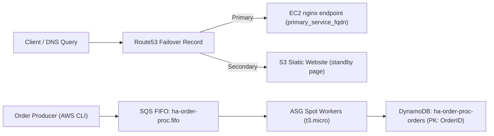

# Resilient Decoupled Order Processor

This project implements the architecture in `NOTES.md`:
- SQS FIFO queue for ordered, deduplicated order intake
- DynamoDB table keyed by `OrderID`
- Spot-only EC2 Auto Scaling Group in private subnets
- Route 53 failover record with an S3 static standby page
- Ansible bootstrapping to install and run a Python worker

## Layout
- `terraform/`: infrastructure
- `ansible/worker.yml`: worker host configuration
- `app/worker.py`: long-running SQS -> DynamoDB processor
- `scripts/send_orders.sh`: enqueue 100 test orders quickly

## Deploy
1. Configure AWS credentials and region.
2. Fill `terraform/terraform.tfvars` from `terraform/terraform.tfvars.example`.
3. Run:
   ```bash
   cd terraform
   terraform init
   terraform apply
   ```

## Test
After apply:
```bash
QUEUE_URL=$(terraform -chdir=terraform output -raw queue_url)
./scripts/send_orders.sh "$QUEUE_URL" 100
```

The worker stores each order once via a conditional DynamoDB write, preserving FIFO order through a single message group.

## Architecture & Evidence

### Architecture (Deployed)



### Deployment Evidence (captured on February 26, 2026)

- AWS account: `628743727012`
- Region: `us-east-1`
- SQS queue ARN: `arn:aws:sqs:us-east-1:628743727012:ha-order-proc.fifo`
- Queue mode: `FIFO=true`
- Queue depth at capture: `ApproximateNumberOfMessages=0`, `ApproximateNumberOfMessagesNotVisible=0`
- DynamoDB table: `ha-order-proc-orders` (`ACTIVE`, `PAY_PER_REQUEST`, hash key `OrderID`)
- ASG: `ha-order-proc-asg` (`desired=2`, `min=1`, `max=4`)
- In-service workers:
  - `i-0720ad87fe48c0b0d` (`us-east-1c`, `t3.micro`, `Healthy`)
  - `i-0f4b5780dbf25da99` (`us-east-1a`, `t3.micro`, `Healthy`)
- Route53 failover records in hosted zone `orders.daryllundy.com`:
  - Primary CNAME -> `ec2-13-223-243-141.compute-1.amazonaws.com`
  - Secondary CNAME -> `ha-order-proc-standby-20260226044019322300000002.s3-website-us-east-1.amazonaws.com`

### Test Evidence

1. Sent load test messages:
   ```bash
   AWS_REGION=us-east-1 ./scripts/send_orders.sh https://sqs.us-east-1.amazonaws.com/628743727012/ha-order-proc.fifo 100
   ```
2. Verified queue drained to zero visible/in-flight messages after processing.
3. Verified ASG workers remained healthy and in service during processing.
4. Verified DNS failover records exist (primary + standby target).

### Notes

- This implementation demonstrates:
  - decoupled processing with SQS FIFO,
  - idempotent writes to DynamoDB,
  - Spot-backed worker fleet via ASG,
  - DNS-level regional failover routing.
- Current Route53 record name resolves to `orders.orders.daryllundy.com` (double `orders`). In hosted zone `orders.daryllundy.com`, use the zone apex record instead.
